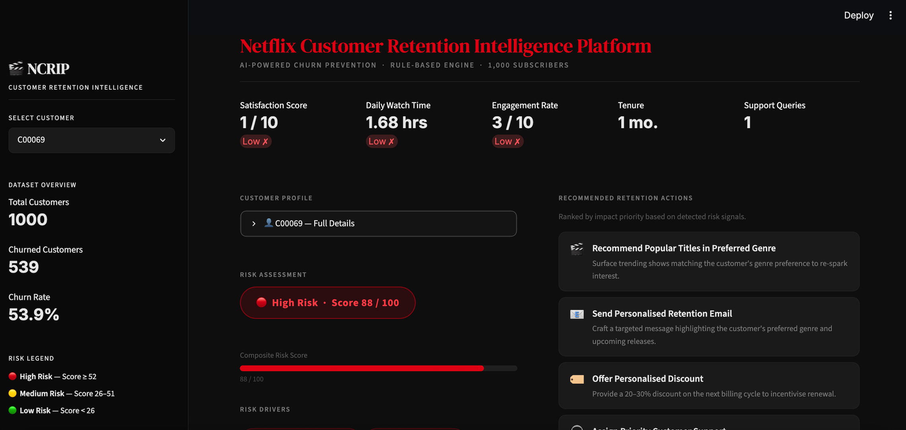
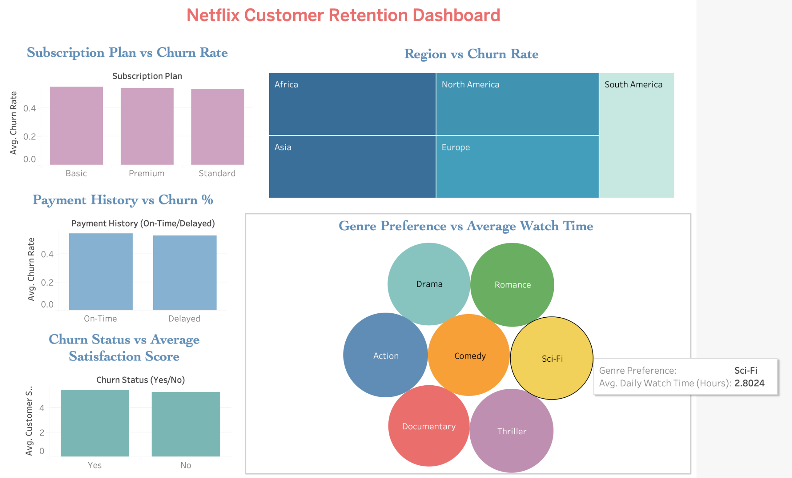

# 🎬 Netflix Customer Retention Intelligence Platform

An end-to-end Customer Retention Analytics platform that combines SQL, Tableau, Python, and Streamlit to identify at-risk customers and generate intelligent retention recommendations.

[](https://netflix-customer-retention-intelligence-platform-gb5rzp3xvjyy9.streamlit.app/)
---

## 📌 Project Overview

Customer churn is one of the biggest challenges faced by subscription-based businesses like Netflix. This project analyzes customer behavior, identifies churn patterns, and provides personalized retention strategies using a heuristic retention recommendation system.

The project covers the complete analytics lifecycle:

- Excel Data Exploration
- SQL Data Cleaning & Business Analysis
- Tableau Business Dashboard
- Python Scoring Recommendation Engine
- Streamlit Web Application

---

## 🚀 Features

- Customer Risk Assessment
- Personalized Retention Recommendations
- Interactive Customer Search
- Composite Risk Score
- Customer Profile Viewer
- Business-Friendly Dashboard
- Netflix-inspired UI

---

## 🛠 Tech Stack

| Tool | Purpose |
|------|---------|
| Excel | Initial Data Exploration |
| MySQL | Data Cleaning & SQL Analysis |
| Tableau | Business Dashboard |
| Python | Recommendation Engine |
| Pandas | Data Processing |
| NumPy | Numerical Operations |
| Streamlit | Interactive Web Application |

---

## 📂 Project Structure

```text
Netflix-Customer-Retention-Intelligence-Platform/
│
├── app.py
├── requirements.txt
├── README.md
├── Data_netflix.csv
├── Netflix_data_cleaning.sql
├── Netflix_churn_analysis.sql
├── Customer_churn_analysis.xlsx
├── Netflix_customer_retention_dashboard.twb
├── recommendation_engine.png
└── Dashboard_tableau.png
```

---

## 📊 Business Questions Solved

- Which subscription plans have the highest churn?
- Which regions experience higher customer churn?
- Does payment history affect churn?
- Which genres drive the highest engagement?
- Which customers are at the highest risk?
- What personalized retention actions should Netflix take?

---

## 🤖 AI Recommendation Engine

The recommendation engine evaluates customer behavior using multiple business signals:

- Customer Satisfaction
- Daily Watch Time
- Engagement Rate
- Subscription Length
- Payment History
- Support Queries
- Promotional Offer Usage

Based on these metrics, customers are classified into:

- 🟢 Low Risk
- 🟡 Medium Risk
- 🔴 High Risk

The system then recommends personalized retention strategies such as:

- Premium Trial
- Personalized Discounts
- Priority Customer Support
- Personalized Retention Emails
- Content Recommendations
- Trending Titles

---

## 📸 Application Preview

### Streamlit Recommendation Engine



### Tableau Dashboard



---

## ⚙️ Installation

Clone the repository

```bash
git clone https://github.com/yourusername/Netflix-Customer-Retention-Intelligence-Platform.git
```

Install dependencies

```bash
pip install -r requirements.txt
```

Run the application

```bash
streamlit run app.py
```

---

## 📈 Future Improvements

- Machine Learning Churn Prediction
- XGBoost Classifier
- SHAP Explainability
- Live Database Integration
- Recommendation API
- User Authentication

---

## 🎯 Key Learnings

- SQL Data Cleaning
- Business KPI Analysis
- Dashboard Design
- Customer Segmentation
- Rule-Based Recommendation Systems
- Streamlit Deployment
- End-to-End Analytics Workflow

---

## 👩‍💻 Author

**D S Nandhushri**

Aspiring Data Analyst | AI & ML Enthusiast

Connect with me on LinkedIn!
